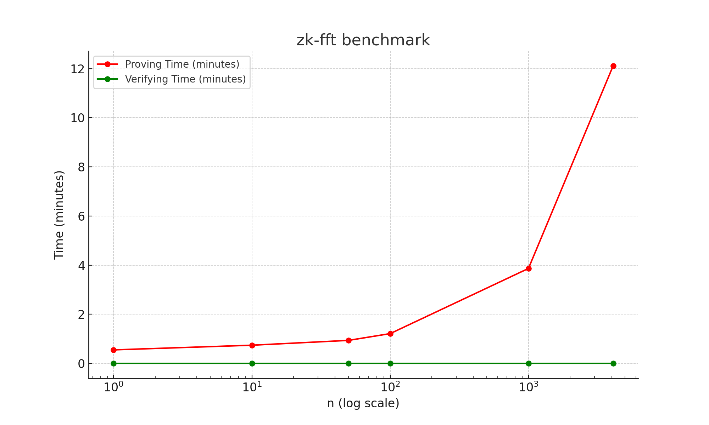

# zk-fft

This project presents a zero-knowledge (ZK) proof generator for the Fast Fourier Transform (FFT) with the Cooley-Tukey algorithm.
It serves as a piece of an alternative to bootstrapping for zero-knowledge in the CKKS scheme within Fully Homomorphic Encryption (FHE).
The aim is to demonstrate the feasibility of such zk proof generation for FFT with real numbers.
We utilized the RISC0 zkVM for implementation. 

## Quick Start

First, make sure [rustup] is installed. The
[`rust-toolchain.toml`][rust-toolchain] file will be used by `cargo` to
automatically install the correct version.

To build all methods and execute the method within the zkVM, run the following
command:

```bash
cargo run
```

### Executing the project locally in development mode

Put together, the command to run your project in development mode while getting execution statistics is:

```bash
RUST_LOG="executor=info" RISC0_DEV_MODE=1 cargo run
```

### Running proofs remotely on Bonsai

If you have access to the URL and API key to Bonsai you can run your proofs
remotely. To prove in Bonsai mode, invoke `cargo run` with two additional
environment variables:

```bash
BONSAI_API_KEY="YOUR_API_KEY" BONSAI_API_URL="BONSAI_URL" cargo run
```

### Test
You can test proof generation and verifciation of FFT within zkVM. It tests for various input sizes.
```bash
cargo test
```

## Benchmarks
Detailed information for performance benchmarks are [here](./host/benches/benchmark.md).

| n | Proving time | Verifying time |
| --- | --- | --- |
| 1 | 33.04s | 82.44ms |
| 10 | 44.43s | 83.83ms |
| 50 | 56.25s | 85.69ms |
| 100 | 72.76s | 90.62ms |
| 1000 | 231.89s | 78.89ms |
| 4096 | 726.64s | 92.49ms |




## Directory Structure

```text
zk-fft
├── Cargo.toml
├── core
│   ├── Cargo.toml
│   └── src
│       └── lib.rs                         <-- [Core type goes here]
├── host
│   ├── Cargo.toml
│   └── src
│       └── main.rs                        <-- [Host code goes here]
└── methods
    ├── Cargo.toml
    ├── build.rs
    ├── guest
    │   ├── Cargo.toml
    │   └── src
    │       └── bin
    │           └── method_name.rs         <-- [Guest code goes here]
    └── src
        └── lib.rs
```

## Note

- This project is part of the [acceleration program](https://github.com/privacy-scaling-explorations/acceleration-program) with PSE team. The project is currently under a rapid development.
- There is an issue with the guest's code, specifically with the 'corr' function. This function performs adequately with a relatively small number of inputs (n), but its error becomes larger as the value of n increases significantly.
- Risc0 supports CUDA operations, but we are encountering bugs enabling it.

[bonsai access]: https://bonsai.xyz/apply
[cargo-risczero]: https://docs.rs/cargo-risczero
[crates]: https://github.com/risc0/risc0/blob/main/README.md#rust-binaries
[dev-docs]: https://dev.risczero.com
[dev-mode]: https://dev.risczero.com/api/zkvm/dev-mode
[discord]: https://discord.gg/risczero
[docs.rs]: https://docs.rs/releases/search?query=risc0
[examples]: https://github.com/risc0/risc0/tree/main/examples
[risc0-build]: https://docs.rs/risc0-build
[risc0-repo]: https://www.github.com/risc0/risc0
[risc0-zkvm]: https://docs.rs/risc0-zkvm
[rustup]: https://rustup.rs
[rust-toolchain]: rust-toolchain.toml
[twitter]: https://twitter.com/risczero
[zkvm-overview]: https://dev.risczero.com/zkvm
[zkhack-iii]: https://www.youtube.com/watch?v=Yg_BGqj_6lg&list=PLcPzhUaCxlCgig7ofeARMPwQ8vbuD6hC5&index=5
