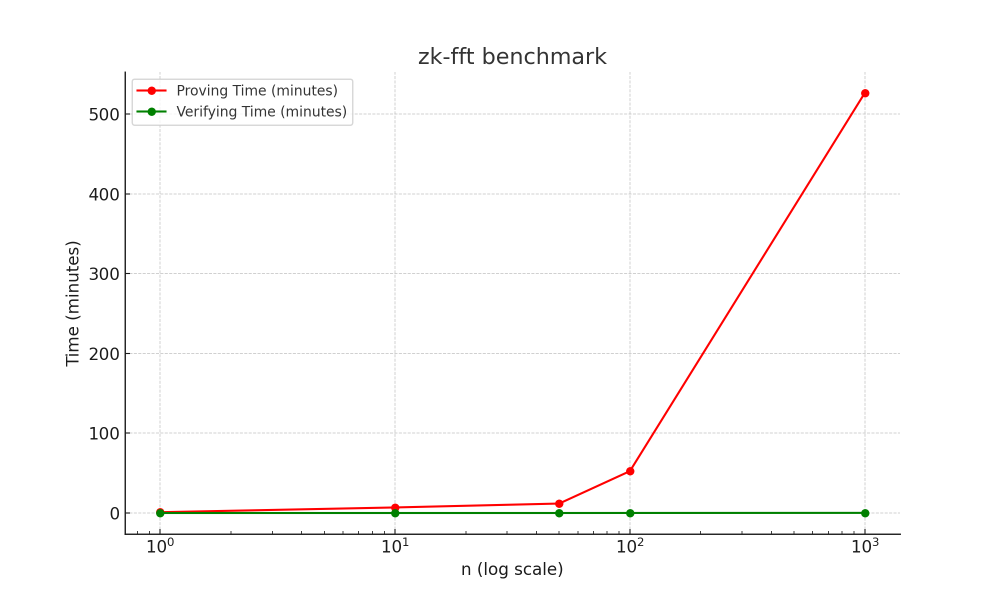

# Benchmark Results

Run tests with:
```bash
bash ./host/src/test.sh > benchmark_results.txt
```

To run tests in the background, use:
```bash
nohup ./host/src/test.sh > benchmark_results.txt &
```

It uses two random polynomials from $\mathbb{Z}[x]$ with degree $n$ as input.
RISC0 zkVM runs multiplication of them using FFT.
Proving time (Proof generation) and Verifying time are measured.

## Results

> **Note**
> All results ran on the local machine.
> 
> **CPU**: i7-12700H <br />
> **Memory**: DDR5 4800MHz 64GB


| n | Proving time | Verifying time |
| --- | --- | --- |
| 1 | 60.92s | 538.20ms |
| 10 | 417.44s | 520.41ms |
| 50 | 711.53s | 463.19ms |
| 100 | 3149.14s | 3.34s |
| 1000 | 31574.50s | 9.37s |

